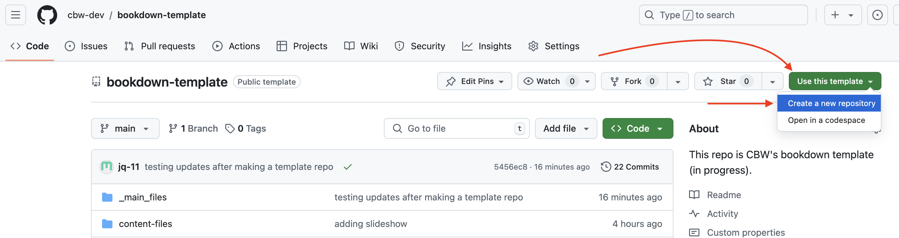

# **New Workshop**: Creation [RC]

Certain aspects of the setup for workshops will be different depending on your role. Headers ending in "[RC]" are for Regional Coordinators. Headers without "[RC]" are assumed to be relevant to both RC and workshop teams.

## Setup the Workshop [RC]

1. First, let's **go to the <a href="https://github.com/cbw-dev/jupyterbook-template" target="_blank">Jupyter Book template</a>**.
<br>
<br>

2. **Click on the "Use this template"** green button, which is to the right of the title of the repository "jupyterbook-template". Then, press the dropdown option: "**Create a new repository**", as seen below.

    
    <br> <!-- enforces a space after the image -->

<br>
<br>

<!-- MUST ADD A LINK TO THE CBW GUIDELINES FOR NAMING -->

3. You will be brought to a "Create a new repository" page. Fill out the blanks as seen below. That is, **change the owner to "bioinformaticsdotca"**, make it **public**, fill in the **repository name and description** according to [CBW Guidelines](). <br>"Include all branches" does not need to be selected.
    
    
    <br>

    This may take a couple seconds to generate. After it loads, you will be brought to a new repository for the new workshop!

<br>

Our next step is to turn these files in your repository into a website. First, we need to get these files locally [(setup a git connection)](ssh-connect) and [deploy using ghp-pages](deploy)! (We will explain what these actions do!)

```{note}
If you don't feel comfortable navigating your folders via Terminal (Linux/macOS) or Command Prompt/Windows PowerShell (Windows), consider reading through and referring to [](command-line).
```

## Setting Up Team Access [RC?] (Nia will fill this in)
